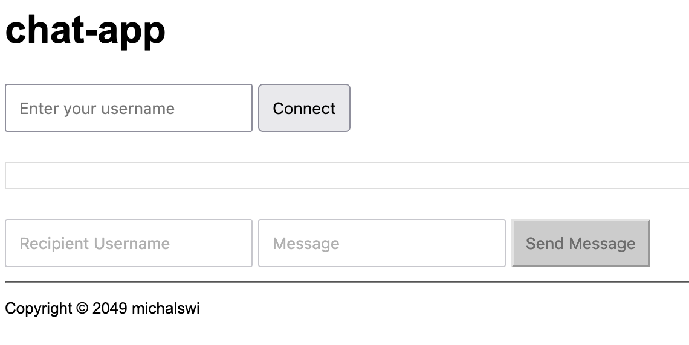
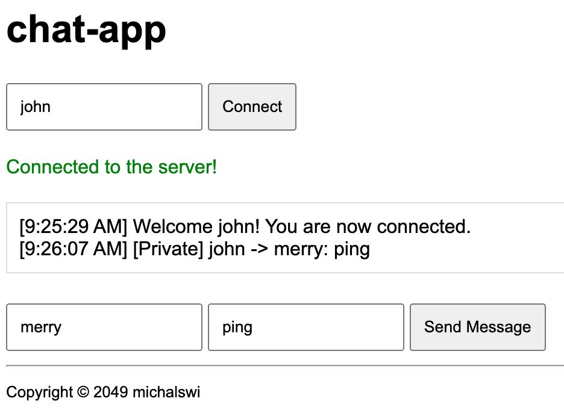
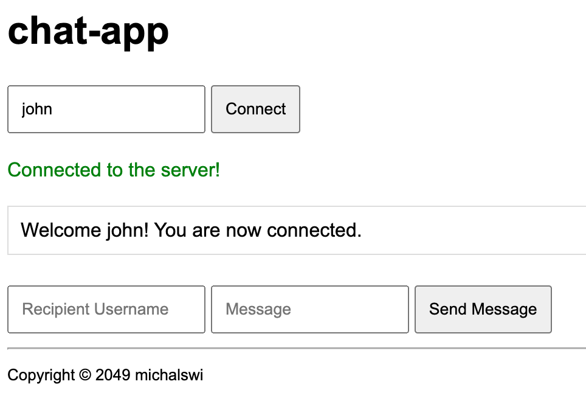

## go-chat-app

Messages are stateless.

### \# server

```
go run main.go

> if self-signed certificate, open first:
https://localhost/
```

### \# client
```
go run client/client.go

> go to: http://localhost/
```



\> connect **john** and send `ping` to **merry**


\> connected **merry** and received message from **john**

