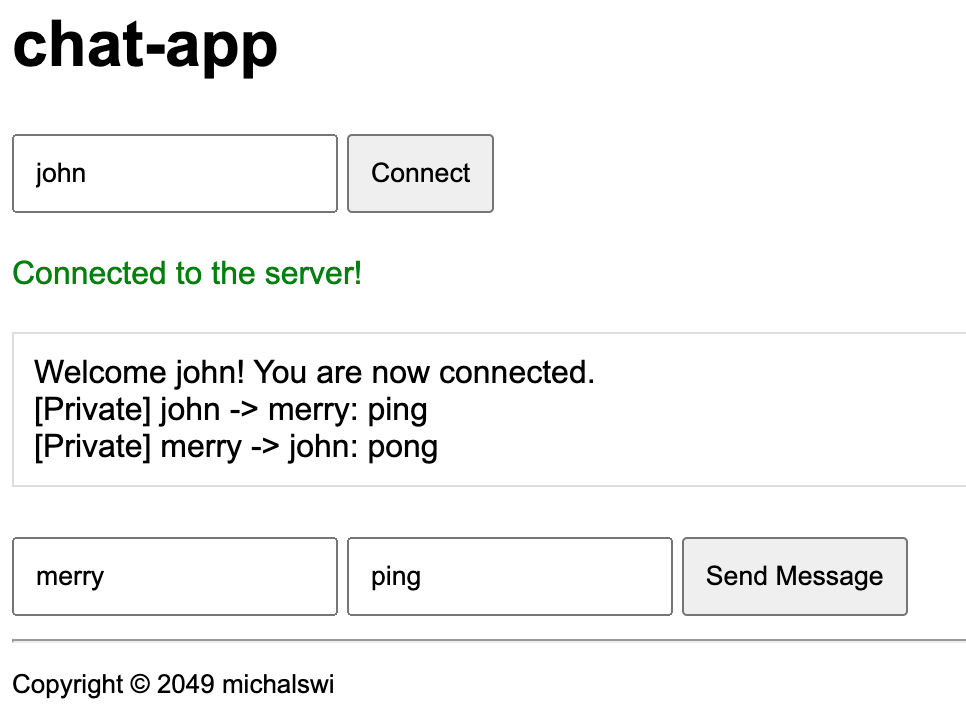
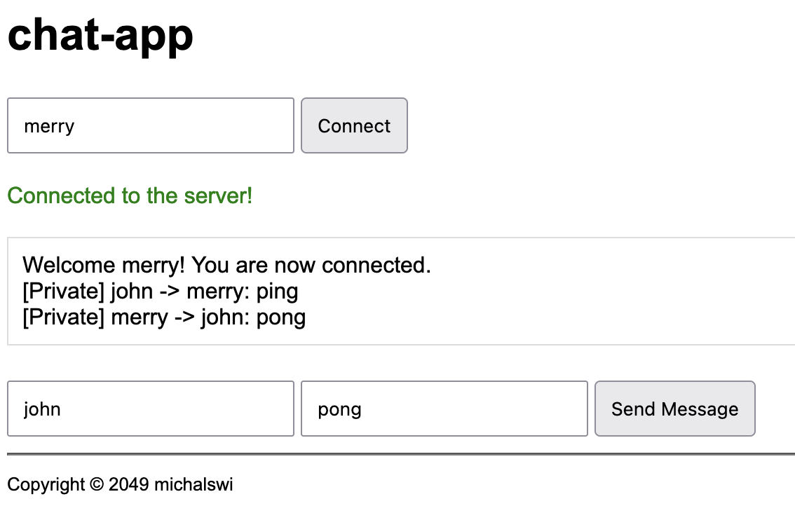

## go-chat-app

Messages are stateless.

### \# server

```
go run main.go

> if self-signed certificate, open first:
https://localhost/
```

### \# client
```
go run client/client.go

> go to: http://localhost/
```


\> connect **merry**


\> connect **john**


\> **john** sends message 'ping' to **merry**


\> **merry** sends message 'pong' to **john**

